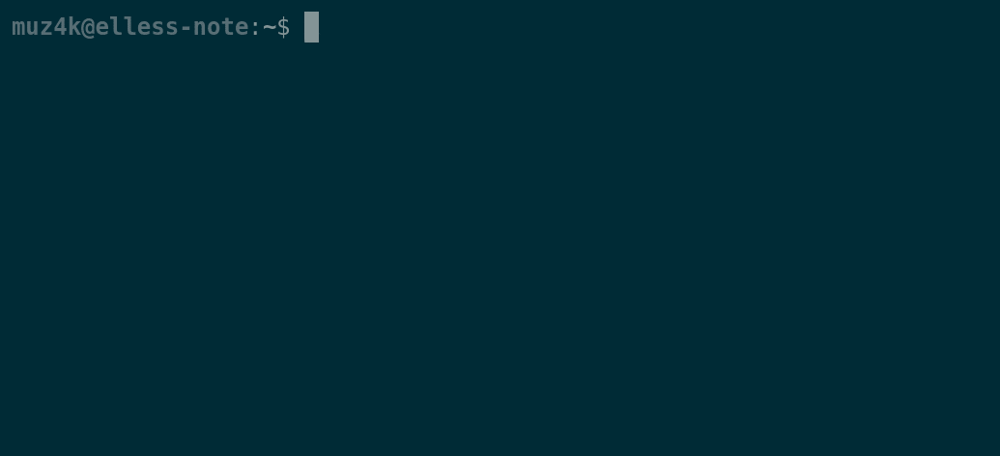
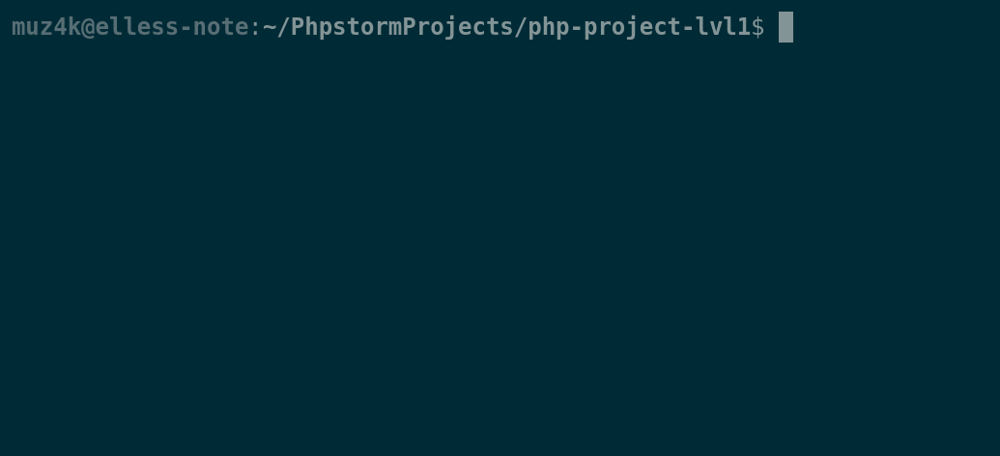
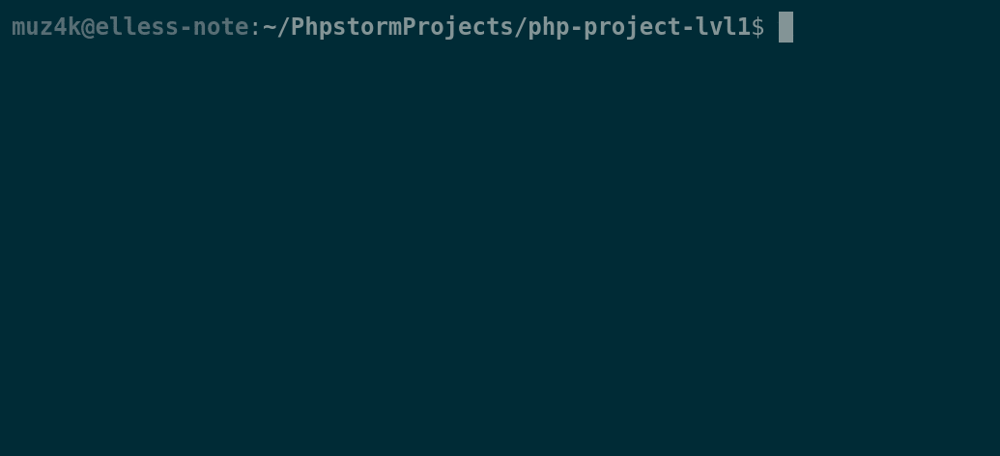
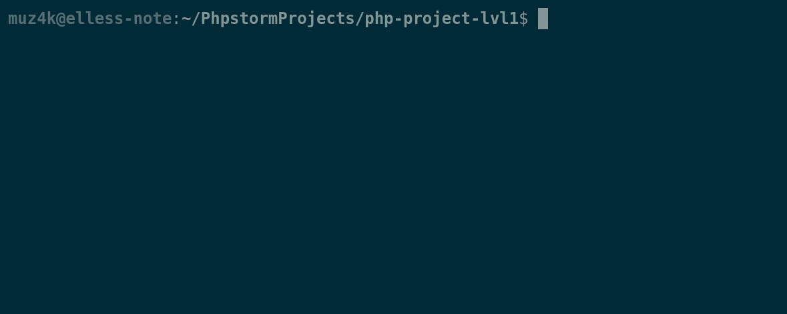

# brain-games

This is a collection of command line games, one of the projects made while learning on the Hexlet platform.
[Read more about Hexlet (in Russian)](https://ru.hexlet.io/pages/about)

## Installation
- install composer globally, if you haven’t done it before (btw, why?;D);
- to install brain-games run:
    
    `composer global require muz4k/brain-games`

- enjoy it.

## How to play
You can choose one of the games:
- brain-even:

- brain-calc:

- brain-gcd:

- brain-prime:

- brain-progression:

## Importantly!
**Don't** write `exit` at the end!
